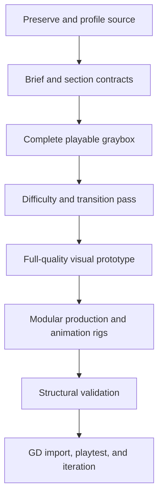

# Geometry Dash AI Agent Skills

A production-focused skill suite for AI agents that inspect, refactor, generate, animate, and validate Geometry Dash levels stored as GDShare `.gmd` files.

The package is designed for a simple workflow: download this repository as a ZIP, upload that ZIP together with one or more `.gmd` files to an AI chat session, and ask the agent to follow the included skills. It is intentionally strict about gameplay, spacing, animation ownership, difficulty evidence, file preservation, and honest validation.

## Download and use in an AI chat

1. Download the current [`develop` branch as a ZIP](https://github.com/bbartling/gd-ai-agent-skills/archive/refs/heads/develop.zip), or select **Code → Download ZIP** on GitHub.
2. Upload the downloaded repository ZIP to your AI chat session.
3. Upload the `.gmd` level you want created, analyzed, or enhanced. Include strong reference `.gmd` files when useful.
4. Give the agent a concrete brief and explicitly tell it to extract the ZIP, read `gd-level-director/SKILL.md`, and follow every routed skill/reference needed for the task.
5. Import the returned candidate into Geometry Dash, playtest it, and provide the resulting `.gmd`, video, screenshots, and test notes for another revision.

Example prompt:

```text
Extract gd-ai-agent-skills-develop.zip and use the included Geometry Dash skills.
Start with gd-level-director/SKILL.md and follow every relevant linked reference.

Enhance my attached level.gmd into a cohesive [difficulty] level with:
- [theme and story]
- [song ID, offset, BPM, or reference level]
- [game modes and mechanics]
- [visual style and animation goals]
- [target length and performance constraints]

Preserve the original file, produce a newly named .gmd, run the bundled structural
validators, and label the result a candidate unless Geometry Dash playtesting evidence
is available. Return the candidate plus a concise build and playtest report.
```

## What is included

| Skill | Responsibility |
|---|---|
| [`gd-level-director`](gd-level-director/SKILL.md) | Coordinates the complete build, balances gameplay/presentation, and enforces release gates. |
| [`gd-geoshare-engineer`](gd-geoshare-engineer/SKILL.md) | Safely decodes, encodes, profiles, compares, and modifies GDShare files while preserving unknown data. |
| [`gd-layout-engineer`](gd-layout-engineer/SKILL.md) | Designs jumpable routes, mode-specific mechanics, transitions, difficulty, and recovery windows. |
| [`gd-animation-engineer`](gd-animation-engineer/SKILL.md) | Builds owned trigger rigs, depth, effects, cameras, multipart assemblies, reset behavior, and LDM. |
| [`gd-level-qa`](gd-level-qa/SKILL.md) | Separates structural, editor, trigger, gameplay, human-quality, and performance evidence. |

Shared resources provide:

- `.gmd` format and trigger-field guidance;
- layout spacing and game-mode difficulty rules;
- animation systems, set-piece patterns, layering, and performance budgets;
- deterministic large-build, boss-fight, destination-reveal, and approximate file-size workflows;
- build briefs, section cards, group/rig ledgers, boss cards, playtest logs, and release scorecards;
- structural analysis, codec, comparison, and validation scripts;
- corpus-derived measurements and adversarial behavior tests.

The reference Geometry Dash levels used during analysis are not redistributed in this repository.

## Recommended agent workflow



The essential rule is simple: a high object count, valid decode, or attractive static preview does not prove a good level. Gameplay, difficulty, visuals, animation, sync, performance, and restart behavior are separate systems with separate evidence.

## Validation language

Use claims that match the evidence actually obtained:

1. **Structurally validated:** the container and payload parse and pass static checks.
2. **Imports and opens:** Geometry Dash accepts the file and the editor displays it.
3. **Trigger-tested:** animation rigs start, stop, reset, replay, and degrade correctly in LDM.
4. **Section-tested:** gameplay and transitions were tested from realistic entries.
5. **Full-run tested:** practice and/or normal-mode clears were completed from zero.
6. **Verified:** the final difficulty and complete run have appropriate human verification.

If the environment cannot launch Geometry Dash, the output must remain a **candidate build requiring GD import and playtest**.

## Local validation

Run from the repository root:

```bash
python3 shared/scripts/analyze_gmd.py level.gmd --json analysis.json --csv summary.csv
python3 shared/scripts/validate_gmd.py level.gmd --json validation.json
python3 shared/scripts/compare_gmd.py original.gmd candidate.gmd
python3 shared/scripts/gmd_codec.py decode level.gmd level-string.txt
```

These scripts require Python 3 and use the standard library. They validate structure and help detect regressions; they do not simulate Geometry Dash physics or runtime triggers.

## Contributing

Keep changes evidence-driven and focused on agent behavior. Validate every `SKILL.md`, preserve relative links, test changed scripts, and add behavioral tests for meaningful failure modes rather than wording preferences. Do not commit copyrighted reference levels, generated `.gmd` builds, chat uploads, caches, or local virtual environments.

## License

MIT — see [`LICENSE`](LICENSE).
